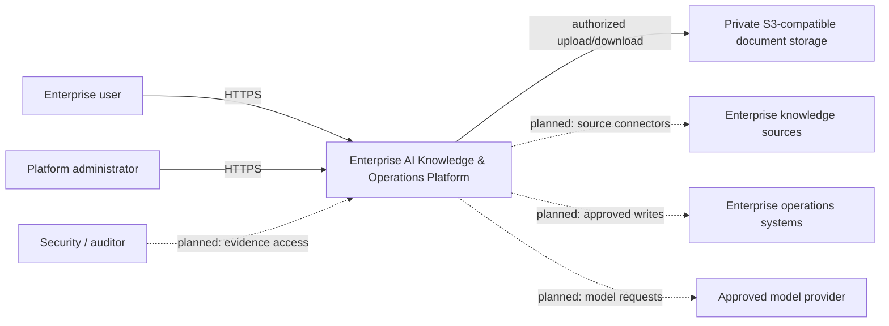
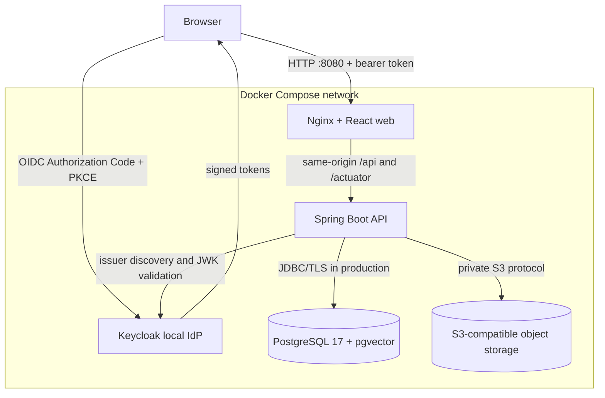

# System Context and Containers

## System context

The platform sits between enterprise users and approved enterprise knowledge or
operations systems. Day 3 adds private document storage and durable extraction
behind the existing authenticated-user and tenant-authorization boundary.

Dashed connections are planned dependencies, not implemented integrations.

## Container-level architecture

The React build is static. Nginx serves it and proxies API calls, avoiding a
wildcard CORS policy. Keycloak handles local authentication. The API validates
tokens and owns database migrations and tenant authorization. PostgreSQL is not
published to browsers.

## Trust boundaries

1. **Browser to edge:** all browser input is untrusted. The development stack is
   HTTP-only; production requires TLS termination and hardened headers.
2. **Edge to API:** Nginx routing does not establish identity. The API remains
   secure by default and denies unspecified endpoints.
3. **API to database:** credentials arrive through environment configuration.
   Production must use distinct least-privilege roles and encrypted transport.
4. **Identity-provider to API:** token payloads become trusted only after signature,
   issuer, expiry, and audience validation. Provider roles do not replace database
   tenant memberships.
5. **Tenant boundary:** the API derives tenant access from the validated subject
   and current database membership. Request-supplied slugs are selectors, not
   authorization context. Cross-tenant negative tests are mandatory.
6. **Object-storage boundary:** the API generates keys from authorized UUID context,
   keeps the bucket private, and streams authorized downloads. Bucket paths and
   credentials never grant browser access or replace current membership checks.
7. **Parser boundary:** filenames, MIME declarations, binaries, and extracted text
   are untrusted. Detection, size/page/text limits, safe failures, and plain-text
   rendering constrain processing; malware scanning remains a documented gap.
8. **Model/tool boundary (planned):** prompts, retrieved content, tool arguments,
   and outputs are untrusted data subject to authorization and audit controls.

## Planned external dependencies

- Enterprise source connectors beyond authenticated direct upload.
- Approved embedding and language-model providers.
- Observability backend for metrics, traces, logs, and alerts.
- Enterprise operations systems exposed through human-approved tools.

Keycloak is connected only as synthetic local development infrastructure. The
remaining external dependencies are still planned and disconnected.
