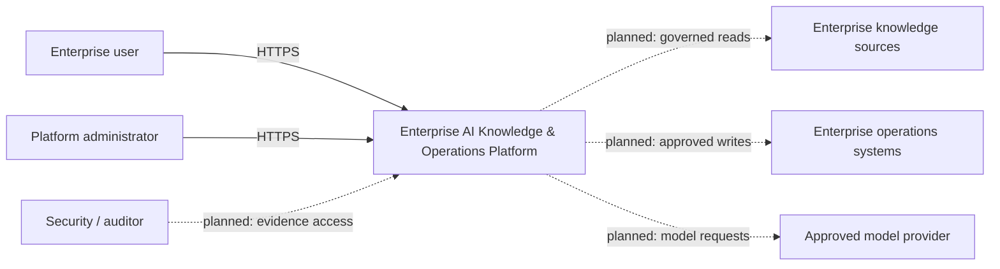
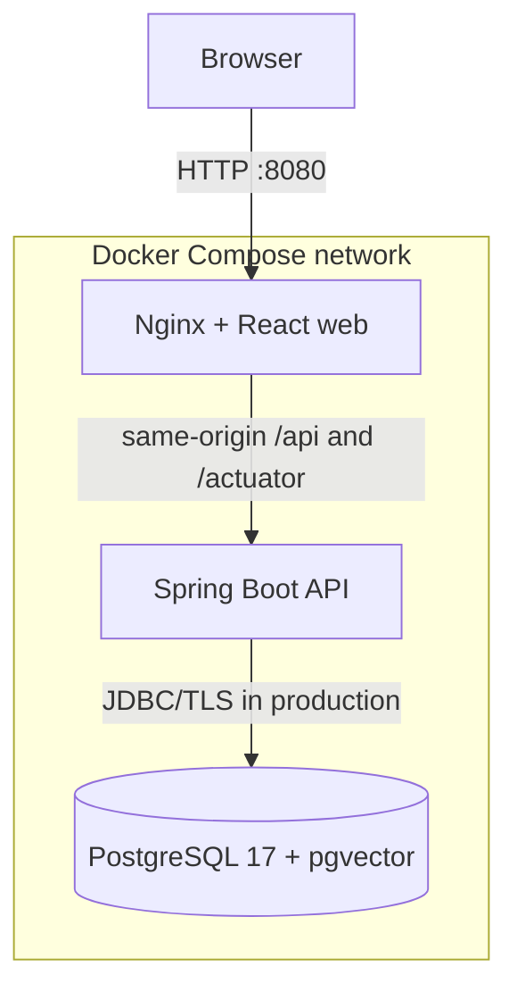

# System Context and Containers

## System context

The platform sits between enterprise users and approved enterprise knowledge or
operations systems. Day 1 implements only the web, API, and database boundary.

Dashed connections are planned dependencies, not implemented integrations.

## Container-level architecture

The React build is static. Nginx serves it and proxies API calls, avoiding a
wildcard CORS policy. The API owns database migrations. PostgreSQL is not
published to browsers.

## Trust boundaries

1. **Browser to edge:** all browser input is untrusted. The development stack is
   HTTP-only; production requires TLS termination and hardened headers.
2. **Edge to API:** Nginx routing does not establish identity. The API remains
   secure by default and denies unspecified endpoints.
3. **API to database:** credentials arrive through environment configuration.
   Production must use distinct least-privilege roles and encrypted transport.
4. **Tenant boundary (planned):** every future data access must carry verified
   tenant context and be tested against confused-deputy and cross-tenant risks.
5. **Model/tool boundary (planned):** prompts, retrieved content, tool arguments,
   and outputs are untrusted data subject to authorization and audit controls.

## Planned external dependencies

- Identity provider using OIDC/OAuth 2.0.
- Approved object storage and enterprise document sources.
- Approved embedding and language-model providers.
- Observability backend for metrics, traces, logs, and alerts.
- Enterprise operations systems exposed through human-approved tools.

None of these external dependencies is connected in Day 1.
