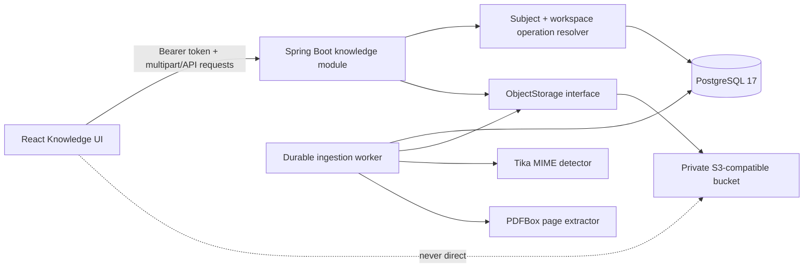
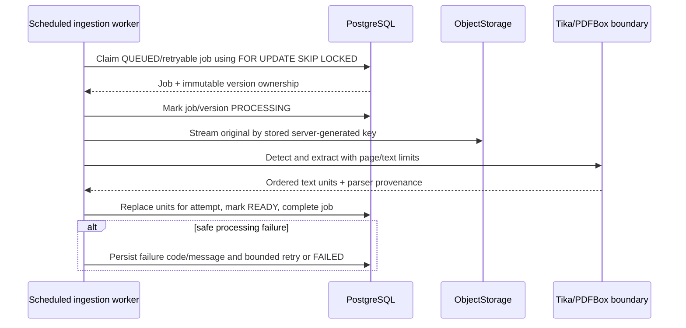
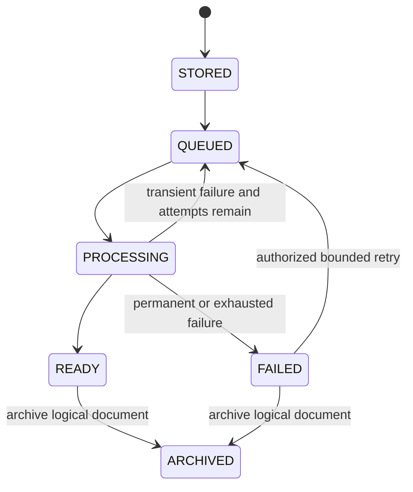

# Document Ingestion Architecture

## Scope

Day 3 implements an authorized knowledge-ingestion boundary: private original
storage, immutable provenance, durable asynchronous extraction, normalized source
units, authorized metadata/download APIs, archival, and a React Knowledge view.
It deliberately excludes embeddings, retrieval, RAG, LLM calls, chat, and MCP.

## Components



The API is authoritative for identity, membership, tenant/workspace ownership,
roles, lifecycle, and storage access. Object keys, hashes, uploader subjects,
parser metadata, and ingestion states are server-owned.

## Upload sequence

```mermaid
sequenceDiagram
  actor User
  participant Web as React UI
  participant API as Knowledge API
  participant Authz as Workspace resolver
  participant S3 as Private object storage
  participant DB as PostgreSQL
  participant Worker as Ingestion worker

  User->>Web: Select supported file and optional title
  Web->>API: Multipart upload with bearer token
  API->>Authz: Resolve subject, organization, workspace, operation
  Authz->>DB: Read current membership and workspace ownership
  DB-->>Authz: Authorized tenant/workspace context
  API->>API: Enforce size/name/type hints; generate UUIDs and key
  API->>S3: Stream original while computing server SHA-256 and size
  API->>DB: Persist document, immutable version, and durable QUEUED job
  API-->>Web: 202 Accepted with safe metadata
  Worker->>DB: Claim pending job transactionally
```

The multipart request is bounded at 20 MiB. The key contains only UUIDs from the
authorized context. If persistence fails after storage succeeds, the service makes
a narrow compensating delete for that newly generated key; it never deletes an
existing version or broad prefix. The S3 write and PostgreSQL transaction are not
atomic: if the process or container terminates after the object is stored but
before metadata commits or the compensating delete runs, an orphaned object can
remain. A production-hardening milestone must add reconciliation and bounded
orphan garbage collection against committed version metadata.

## Asynchronous processing sequence



Pending work is durable in PostgreSQL, not memory. Claims use row locks with
`SKIP LOCKED`; attempts are bounded. A process crash leaves a stale PROCESSING job
that a later poll may recover after its claim timeout. Unit writes and READY state
transition occur transactionally.

## Storage and provenance model

- `documents` owns logical identity, organization/workspace, title, lifecycle,
  creator, and archival timestamps.
- `document_versions` owns immutable version number, sanitized filename,
  declared/detected MIME, byte size, SHA-256, object key, parser provenance,
  ingestion state, safe failure data, uploader, and timestamps.
- `document_ingestion_jobs` owns durable state, attempts, scheduling, claims,
  completion, and safe errors for exactly one version.
- `document_text_units` owns deterministic order, locator type/value, normalized
  plain text, character count, and extraction time for exactly one version.

Documents have a composite `(id, organization_id, workspace_id)` ownership key;
versions carry the same tenant IDs and reference that key. Jobs and text units
carry version plus tenant IDs and reference the version composite key. These
redundant tenant columns permit database-level rejection of confused ownership
without making background jobs independently tenant-selectable.

## Authorization model

The resolver evaluates five facts on every request:

1. the signed JWT subject maps to a current local profile;
2. the requested organization exists and is authorized;
3. the workspace belongs to that organization;
4. a current organization-level or matching workspace membership grants scope;
5. the effective application/platform role permits the requested operation.

| Role | Metadata/list | Original download | Upload/new version | Archive/retry |
| --- | --- | --- | --- | --- |
| `PLATFORM_ADMIN` | Any tenant | Yes | Yes | Yes |
| `TENANT_ADMIN` | Authorized scope | Yes | Yes | Yes |
| `MEMBER` | Authorized scope | Yes | No | No |
| `AUDITOR` | Authorized metadata/provenance | No | No | No |

The platform role does not manufacture tenant ownership except for the explicit,
tested `PLATFORM_ADMIN` bypass. UI role checks only hide unavailable actions.

## Formats and resource bounds

| Format | Detection and extraction | Locator |
| --- | --- | --- |
| PDF | Tika detection; PDFBox 3.0.7 page-by-page extraction | `PAGE`, 1-based page |
| Plain text | Tika detection; strict UTF-8 normalized as one unit | `DOCUMENT`, `body` |
| Markdown | Extension plus text MIME verification; strict UTF-8 as one unit | `DOCUMENT`, `body` |

Day 3 limits originals to 20 MiB, PDFs to 200 pages, and extracted normalized
text to 2,000,000 characters. Empty documents, mismatched/unsupported types, and
limit violations use stable safe error codes. Extracted text is data and is never
rendered as raw HTML or written to logs.

## Lifecycle and failure model



Invalid transitions return conflict. Safe codes include
`UNSUPPORTED_MEDIA_TYPE`, `FILE_TOO_LARGE`, `CONTENT_TYPE_MISMATCH`,
`EMPTY_DOCUMENT`, `PARSER_FAILURE`, `TEXT_LIMIT_EXCEEDED`, `STORAGE_FAILURE`, and
`INTERNAL_PROCESSING_ERROR`. Responses contain no raw exception or stack trace.
Archival locks the logical document and succeeds only when every version is
`READY` or `FAILED` and every job is `COMPLETED` or `FAILED`. Retry takes the same
document lock and requires the logical document to remain `ACTIVE`, preventing an
archive/retry race from producing `FAILED -> ARCHIVED -> QUEUED`.

## Relationship to retrieval

Day 4 indexes authorized READY text units while carrying the same organization,
workspace, document, version, text-unit, and stored-locator identity into every
chunk. Candidate SQL rechecks current membership and ACTIVE document state before
ranking. Retrieval does not alter the Day 3 originals, text units, lifecycle, or
provenance, and it introduces no prompt, generated answer, or model-completion
behavior.
