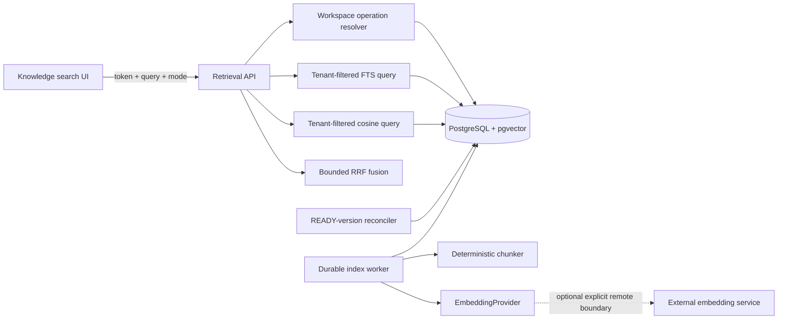
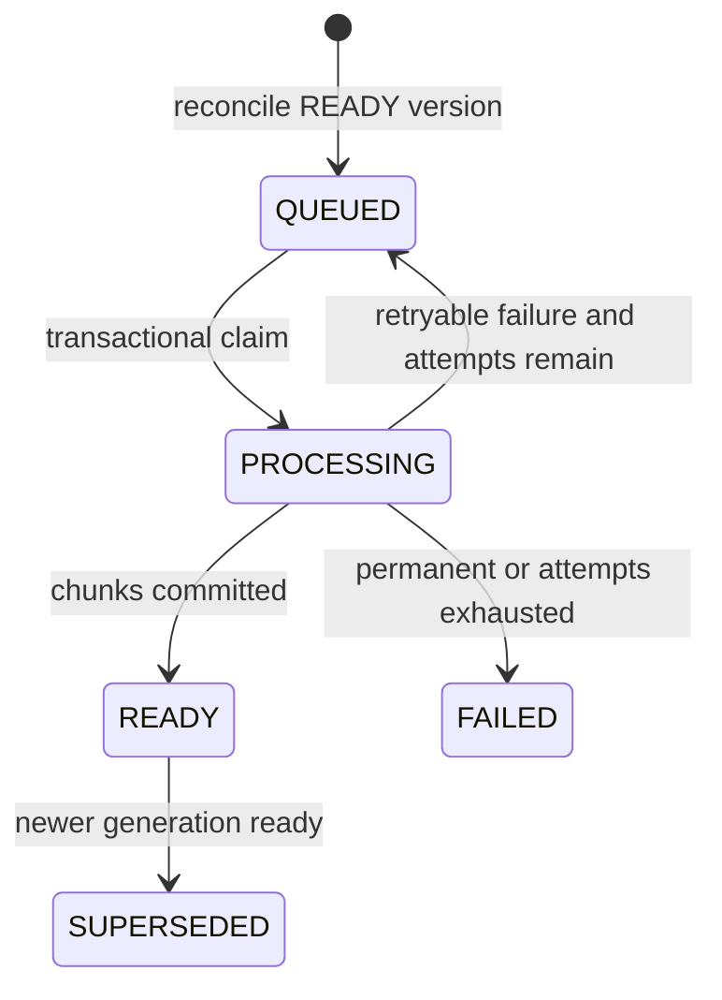

# Tenant-Authorized Hybrid Retrieval Architecture

## Scope

Day 4 turns READY Day 3 text units into deterministic chunks and cited search
results. It provides lexical, vector, hybrid, and capability APIs plus automated
retrieval evaluation. It does not generate answers, prompts, summaries, chat,
agents, tools, workflows, or MCP behavior.

## Components and trust boundaries

The browser supplies slugs, a query, requested mode, and top-K. It cannot supply
tenant IDs, ownership, vectors, scores, locators, index state, or model metadata.
The API resolves signed identity and current membership before any candidate SQL.

## V4 storage model

- `retrieval_indexes`: immutable generations for one document version, with
  tenant/document ownership, chunker configuration, optional provider/model/
  dimension provenance, lifecycle, safe failure data, and readiness/cutover time.
- `retrieval_index_jobs`: durable QUEUED/PROCESSING/COMPLETED/FAILED work with
  bounded attempts, next-attempt time, claims, stale recovery, and safe errors.
- `retrieval_chunks`: ordered chunks with index/version/document/tenant ownership,
  source text-unit ID, persisted Day 3 locator, source-relative character offsets,
  bounded plain text, generated lexical representation, optional vector, and
  embedding compatibility metadata.

Composite foreign keys preserve this lineage:

`chunk -> text unit -> immutable version -> logical document -> workspace -> organization`

## Indexing lifecycle

A scheduled reconciliation transaction inserts generation 1 plus one job for
every READY version that lacks an index. Unique constraints and `ON CONFLICT DO
NOTHING` make deployment backfill and concurrent pollers idempotent. Jobs use
`FOR UPDATE SKIP LOCKED`, at most three attempts, and stale-claim recovery. Chunk
writes and READY transition commit together.

## Deterministic chunking

The `paragraph-whitespace` chunker version `1` processes one Day 3 text unit at a
time. It targets at most 1,200 characters with 150 characters of overlap, prefers
paragraph/newline/whitespace boundaries, never emits blank chunks, and caps a
version at 2,000 chunks. Offsets are UTF-16 Java character offsets relative to the
source text unit and satisfy `[start, end)`. A PDF page is one text unit, so chunks
cannot cross pages. TXT and Markdown retain `DOCUMENT/body`.

The same text, unit order, and configuration produce the same ordered text and
offsets. Chunk UUIDs are deterministically derived from the immutable index,
source unit, ordinal, and offsets.

## Embedding behavior

`EmbeddingProvider` supports bounded batch embedding, query embedding, provider
identifier, model identifier, and fixed dimension. All values must be finite and
exactly match configured provenance before persistence or comparison.

Default/production behavior has no provider: indexes contain lexical chunks only,
capabilities report vector/hybrid unavailable, AUTO uses LEXICAL, and explicit
VECTOR/HYBRID returns a controlled conflict. Local/test composed verification may
explicitly select `deterministic-smoke`, a 64-dimensional normalized hashed-token
provider. It is test plumbing, not a meaningful production embedding model.

No Spring AI or other dependency was added. A narrow application-owned interface
keeps the retrieval domain independent of commercial adapters and avoids pulling
chat/model APIs into the Day 4 dependency graph. Remote-provider timeouts and
reindex orchestration remain requirements for the future adapter that introduces
that boundary.

If a future remote provider is enabled, extracted text and search queries cross
the platform boundary. That must be opt-in, time-bounded, secret-safe, and approved
through organizational privacy/data-governance review.

## Candidate authorization and last-known-good versions

Every lexical and vector query begins with organization/workspace predicates and
joins only ACTIVE documents, READY Day 3 versions, and READY retrieval indexes.
It also excludes a candidate when a newer READY index exists for the same logical
document. Ranking never sees unauthorized, archived, or obsolete candidates.

Therefore:

- version 1 READY/indexed remains searchable while version 2 ingests or indexes;
- version 2 replaces version 1 only when version 2's index transaction reaches READY;
- a FAILED version 2 index leaves version 1 searchable;
- a newer index generation replaces an older generation only after READY;
- archive removes all versions immediately through the ACTIVE-document predicate.

Old chunks remain immutable for audit/recovery and are not physically erased.

## Retrieval algorithms and bounds

- Query length: 1–2,000 characters after stripping.
- Requested `topK`: 1–20.
- Each lexical/vector candidate list: at most 50.
- Lexical: `websearch_to_tsquery('simple', query)` plus `ts_rank_cd`.
- Vector: exact cosine similarity `1 - (embedding <=> queryVector)` after tenant,
  lifecycle, provider, model, and dimension filters.
- Hybrid: RRF score `sum(1 / (60 + rank))`; raw lexical/vector scores are never
  added. Stable tie-breakers use best component rank then chunk UUID.
- AUTO: HYBRID when the configured provider matches indexed vectors, otherwise
  LEXICAL. The response always reports requested and used modes.

## Citation response

Every result includes rank, immutable document/version/chunk IDs, version number,
title, locator type/value, source-relative offsets, bounded plain-text
snippet, and component/fused scores. PDF locators are persisted page numbers;
TXT/Markdown use `DOCUMENT/body`. No page is inferred and no content is generated.

## Authorization matrix

| Role | Search content | Modes | Capabilities/index metadata |
| --- | --- | --- | --- |
| `PLATFORM_ADMIN` | Any tenant | Lexical/vector/hybrid | Yes |
| `TENANT_ADMIN` | Authorized workspace | Lexical/vector/hybrid | Yes |
| `MEMBER` | Authorized workspace | Lexical/vector/hybrid | Capabilities only |
| `AUDITOR` | No snippets | None (403) | Existing document provenance only |

Frontend visibility is convenience only; the backend operation resolver is the
authority.

## Failure model

Stable index failures include `CHUNKING_FAILURE`, `CHUNK_LIMIT_EXCEEDED`,
`EMBEDDING_PROVIDER_UNAVAILABLE`, `EMBEDDING_TIMEOUT`,
`EMBEDDING_RESPONSE_INVALID`, `EMBEDDING_DIMENSION_MISMATCH`,
`INDEX_PERSISTENCE_FAILURE`, and `INTERNAL_INDEXING_ERROR`. Clients receive no
raw exception. Logs carry identifiers, lifecycle, counts, modes, and durations,
never full queries, chunks, text, vectors, tokens, or secrets.

Search completion logs include a random query ID, authorized tenant IDs, requested
and used modes, query length, bounded candidate/result counts, top-K, and duration.
Index logs include tenant/document/version/index/job IDs, generation, terminal
status, chunk count, configured provider/model identifiers, safe failure code, and
duration. Neither path logs actual query/chunk text or embeddings.

## Known limitations

- Only immutable generation 1 is reconciled automatically; there is no admin
  reindex/model-migration endpoint yet.
- Base/production configuration has no semantic embedding adapter. The local
  deterministic provider validates plumbing only.
- Cosine retrieval is an exact scan without HNSW/IVFFlat, appropriate to the
  current bounded corpus but not yet benchmarked for large tenant datasets.
- PostgreSQL `simple` full-text configuration provides limited stemming and CJK
  segmentation.
- Old immutable chunks are retained and excluded logically; physical retention
  deletion remains future work.
- No RAG answer, LLM, prompt, reranker, chat, agent, MCP, or workflow exists.
