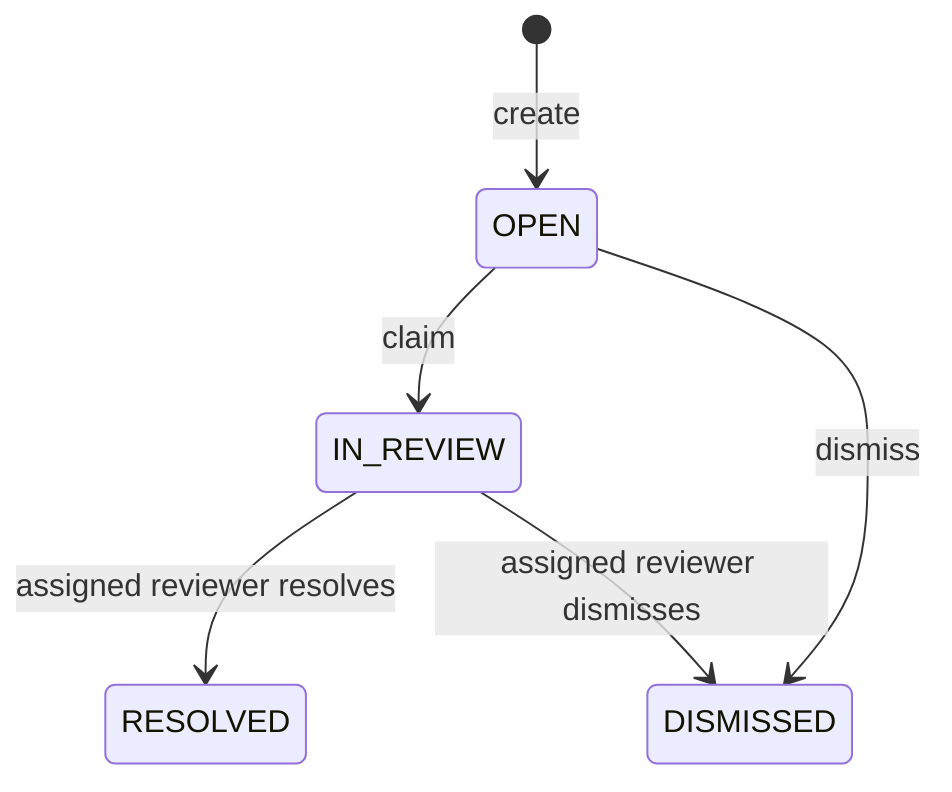

# Day 6 design audit: human review and append-only audit

## Existing insertion points

Day 5 already resolves an authenticated subject to an organization/workspace
`WorkspaceAccessContext`, authorizes `ANSWER_FROM_KNOWLEDGE`, reuses the Day 4
retrieval boundary, assigns request-local citation aliases, and reconstructs
canonical provenance. It returns an answer request UUID but does not persist the
answer, question, or evidence. Day 6 therefore extends this boundary instead of
creating another query or retrieval abstraction.

The existing `workflow` and `audit` packages are empty modular-monolith
boundaries. Day 6 owns review lifecycle code in `workflow.review` and durable
business events in `audit`. PostgreSQL/Flyway, Spring Data JPA, the shared
`WorkspaceAuthorizationService`, `KnowledgeApiException` response format, typed
React API client, and existing dashboard workspace selectors are reused.

## New persisted entities

- `answer_attempts` stores the authoritative question, result, retrieval modes,
  bounded operational metadata, creator, and timestamp. The Day 5 request UUID
  becomes the durable answer-attempt identifier.
- `answer_attempt_evidence` snapshots every bounded evidence item that entered
  the model context, including its request-local alias, cited flag, chunk,
  document/version, locator, offsets, and exact bounded excerpt. Review never
  reruns retrieval.
- `review_cases` references one answer attempt, is tenant/workspace scoped, and
  records creator, optional assignee, reason, lifecycle result, notes,
  timestamps, and an optimistic-lock version.
- `audit_events` stores typed append-only business events for a review case.
  Metadata is bounded JSON generated by the application and contains reason or
  resolution enums only—not questions, answers, evidence, prompts, secrets, or
  arbitrary client JSON.

A partial unique index permits at most one active (`OPEN` or `IN_REVIEW`) review
case for an answer attempt. Closed cases do not prevent a later explicit review
request.

## State machine

All other transitions return HTTP 409. Claim locks the scoped row in one
transaction, so exactly one concurrent reviewer moves `OPEN` to `IN_REVIEW`.
The aggregate also has an optimistic version; stale writes map to a controlled
conflict.

## Authorization

Existing roles are sufficient:

- `MEMBER`: create a review for an answer attempt they created and list/view
  only their own cases in an authorized workspace.
- `TENANT_ADMIN`: list/view all cases in an authorized workspace and
  create/claim/resolve/dismiss.
- `PLATFORM_ADMIN`: the same reviewer capabilities across authorized scopes.
- `AUDITOR`: remains metadata-only and cannot access answer/evidence review
  content.

Every command first resolves the organization/workspace from the route and
current membership. Workspace/user identifiers, answer content, evidence,
citations, and audit actors are never accepted from client payloads. Missing and
inaccessible records use the same not-found boundary where practical.

## API design

All endpoints remain under the existing tenant/workspace route:

- `POST /answers/{answerId}/review-case` — reason and optional note only;
  returns the existing active case when retried.
- `GET /review-cases` — bounded pagination plus status, reason,
  `assignedToMe`, `unassigned`, and `createdByMe` filters.
- `GET /review-cases/{caseId}` — immutable answer/evidence snapshot, review
  metadata, and audit timeline.
- `GET /review-cases/{caseId}/audit-events` — chronological safe events.
- `POST /review-cases/{caseId}/claim`
- `POST /review-cases/{caseId}/resolve` — resolution enum and reviewer note.
- `POST /review-cases/{caseId}/dismiss` — optional reviewer note.

The review API never serializes model-provider configuration, API keys, hidden
prompts, object keys, tokens, or tenant data outside the authorized scope.

## Frontend flow

The existing single-turn answer card gains a small **Send to review** CTA for
`INSUFFICIENT_EVIDENCE` and a secondary **Request review** action for answered
results. The selected organization/workspace also hosts a Review Inbox. Members
see their own cases; reviewers see the workspace queue and can claim, resolve,
or dismiss. Detail renders the frozen question, answer, cited/all evidence,
canonical provenance, review metadata, and chronological audit timeline.

HTTP 409 refreshes the selected case and displays a race/transition message;
403, 404, validation, and network errors remain explicit.
