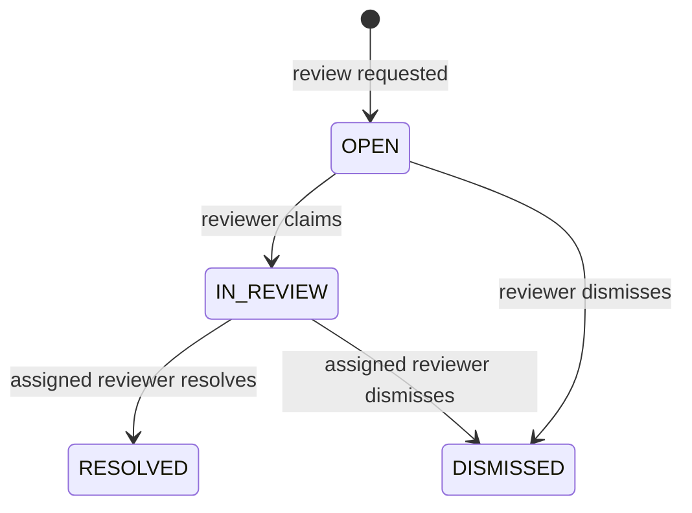

# Day 6 human review workflow

## Architecture

Day 6 turns the existing Day 5 answer request identifier into a durable
`answer_attempt`. The answer service writes the exact bounded question, answer,
retrieval modes, result status, and every evidence item that entered the model
context in the same transaction. A review case points to that immutable
snapshot. Opening a review never reruns retrieval or generation, so a reviewer
sees what the user actually saw even if documents are later reindexed or
archived.

The implementation stays inside the modular monolith:

- `answer` owns authoritative answer/evidence persistence;
- `workflow.review` owns the aggregate, commands, inbox queries, and HTTP API;
- `audit` appends typed review lifecycle events;
- the existing tenant authorization service remains the only scope resolver.

Inbox rows are loaded with one joined, paginated query. Detail uses one bounded
answer query plus fixed evidence and audit queries; it does not load document
graphs or perform a query per result.

## State machine



No generic status update endpoint exists. Illegal transitions return `409` with
a stable domain error. `RESOLVED` and `DISMISSED` are terminal for a case.

## Authorization model

| Principal | Create | List/detail | Claim/resolve/dismiss |
| --- | --- | --- | --- |
| `MEMBER` | Own answer in authorized workspace | Own cases only | No |
| `TENANT_ADMIN` | Any accessible answer | All cases in authorized workspace | Yes |
| `PLATFORM_ADMIN` | Any scoped answer | All scoped cases | Yes |
| `AUDITOR` | No | No answer/evidence content | No |

The server derives organization, workspace, actor, and answer/evidence from the
authenticated subject and route. The client cannot submit those fields.
Inaccessible and cross-workspace resources are not disclosed. An `IN_REVIEW`
case can be resolved or dismissed only by its persisted assignee.

## Audit-event model

`audit_events` is an application append-only event stream. The normal business
API exposes reads and inserts events only as part of a successful lifecycle
transaction; it has no update or delete endpoint.

| Event | Written with | Safe metadata |
| --- | --- | --- |
| `REVIEW_CASE_CREATED` | `OPEN` case insert | reason enum |
| `REVIEW_CASE_CLAIMED` | `OPEN → IN_REVIEW` | none |
| `REVIEW_CASE_RESOLVED` | `IN_REVIEW → RESOLVED` | resolution enum |
| `REVIEW_CASE_DISMISSED` | `OPEN/IN_REVIEW → DISMISSED` | none |

Actor subject and timestamp are server-derived. Audit metadata never contains
questions, answers, evidence, prompts, provider settings, credentials, tokens,
or arbitrary client JSON. Events are returned chronologically by timestamp and
immutable event ID.

## API endpoints

All routes are rooted at
`/api/v1/organizations/{organization}/workspaces/{workspace}`.

| Method and path | Behavior |
| --- | --- |
| `POST /answers/{answerId}/review-case` | Create or return the active case; accepts reason and optional note |
| `GET /review-cases` | Paginated inbox with status, reason, assigned-to-me, unassigned, and created-by-me filters |
| `GET /review-cases/{caseId}` | Frozen question, answer, evidence/provenance, lifecycle, and timeline |
| `GET /review-cases/{caseId}/audit-events` | Chronological safe event view |
| `POST /review-cases/{caseId}/claim` | Atomically claim an `OPEN` case |
| `POST /review-cases/{caseId}/resolve` | Assigned reviewer supplies resolution, optional note, and observed version |
| `POST /review-cases/{caseId}/dismiss` | Authorized reviewer dismisses with optional note and observed version |

Creation returns `201` for a new case and `200` when idempotently returning the
existing active case. Invalid lifecycle or stale/concurrent writes return
`409`; invalid input returns `400`; role denial returns `403`.

## Database tables

- `answer_attempts`: authoritative bounded AI result and creator.
- `answer_attempt_evidence`: exact context/citation snapshot with composite
  tenant foreign keys to immutable retrieval chunks.
- `review_cases`: workspace-scoped aggregate with status, reason, resolution,
  assignee, timestamps, and JPA `@Version` column.
- `audit_events`: typed, tenant-scoped review events and bounded JSON metadata.

A partial unique index on `review_cases(answer_attempt_id)` where status is
`OPEN` or `IN_REVIEW` guarantees at most one active case per answer. Composite
foreign keys preserve organization/workspace ownership through the source
answer, evidence, review, and audit chain.

## Race-condition handling

Claim, resolve, and dismiss lock the tenant-scoped review row with
`PESSIMISTIC_WRITE` for the transaction. Two independent claims therefore
serialize: one commits `IN_REVIEW`; the loser observes the new state and gets
`409`. The aggregate also has optimistic versioning, and resolve/dismiss accept
the UI's observed version so stale decisions fail instead of overwriting a
newer state. Lifecycle state and its event are committed in the same database
transaction.

## Deterministic local demo

Start the local stack, then run:

```bash
make review-verify
```

The verifier uses only synthetic local accounts and the deterministic provider.
It asks an intentionally unsupported question, confirms
`INSUFFICIENT_EVIDENCE`, creates a review as the member, loads the persisted
empty evidence snapshot as the reviewer, claims the case, resolves it as
`KNOWLEDGE_GAP`, and verifies the ordered CREATED → CLAIMED → RESOLVED timeline.
It never prints tokens or credentials. The run intentionally leaves the closed
review and answer snapshot in the local development database as demo evidence.

The same flow is available in the web UI: sign in as the member, ask an
unsupported question, select **Request human review**, then sign in as the
admin and use **Review Inbox** to inspect, claim, and resolve the case.

## Design tradeoffs and limitations

- This is a focused review aggregate, not a generic ticketing or BPMN engine.
- There are no notifications, SLA timers, reassignment, bulk actions, or
  automated side effects.
- Answer/evidence and audit records are immutable through normal application
  APIs. Database operators retain administrative capabilities and must govern
  them through production database controls and backups.
- Provider/model identifiers remain stored for internal operational traceability
  but are intentionally absent from review DTOs.
- Day 6 adds no chat, memory, agents, MCP, email, Slack, or workflow execution.
