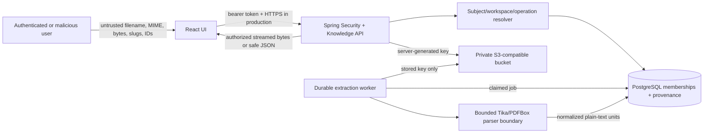

# Document Ingestion Threat Model

## Scope and assets

This model covers authenticated upload, private original storage, document
metadata/provenance, durable extraction jobs, normalized text, authorized
download, versioning, archival, and the Knowledge UI. Assets include original
bytes, hashes, filenames, tenant/workspace identity, parser outputs, object-store
credentials, lifecycle/job state, and authorization decisions.

It does not claim malware protection or production hardening and does not cover
future embeddings, retrieval, RAG, LLM, chat, MCP, or workflow execution.

## Trust boundaries and data flow

The browser, URL parameters, filename, declared MIME, binary, object identifiers,
and parser input are untrusted. Trust begins only after token validation and
current database authorization. Object storage is a protected asset, not an
authorization oracle.

## Threat analysis

| Threat | Trust boundary | Mitigation | Residual risk |
| --- | --- | --- | --- |
| Cross-tenant list or file access | API request to tenant resolver | Resolve validated subject plus current org/workspace membership; tenant-scoped queries; negative tests | Authorization bugs in new queries remain possible and require review/test coverage |
| IDOR by document/version UUID | URL ID to repository | Load only by authorized org/workspace plus ID; return generic not-found/denied semantics | UUID secrecy is not relied upon |
| Acme organization with Globex workspace | URL slugs to workspace resolver | Composite database ownership and explicit workspace lookup by organization | Platform-admin bypass remains privileged and must be audited later |
| Object-key manipulation | Client request to storage adapter | Never accept keys from clients; derive opaque UUID segments after authorization | Database compromise can still expose stored keys |
| Malicious filename/path traversal | Multipart metadata to API | Strip path components/control characters; bound length; filename is metadata only | Unicode confusables may remain misleading to humans |
| MIME spoofing | Declared MIME to detector | Extension is a hint; Tika/magic detection is authoritative; mismatch returns 415 | Polyglot or parser-ambiguous files may evade simple detection |
| Oversized upload | Network/multipart boundary | Spring multipart and application streaming limits at 20 MiB; 413 response | Reverse proxy/body buffering needs production tuning |
| Parser denial of service | Stored bytes to parser | 200 PDF pages, 2M extracted characters, bounded job attempts, one controlled worker pool | Crafted files may still consume significant CPU within bounds |
| Decompression/parser bomb | Parser boundary | No ZIP/Office/images; PDF page/text limits; dependency updates; timeouts planned | PDF internals may allocate before limits are observable |
| Malicious PDF active content | Storage/parser boundary | Never execute/render PDF server-side; extract text only; download uses attachment headers | A downloaded malicious PDF may still target the user's local viewer |
| XSS through extracted text/title/filename | API JSON to React | React escaped rendering; no raw HTML; safe content-disposition encoding | Future rich preview features must re-threat-model rendering |
| Unauthorized download | Browser to API/storage | Backend streams only after current read/download authorization; no public/presigned URL | Long downloads may outlive a membership revocation after authorization |
| Unauthorized archive/version/retry | API operation boundary | Least-privilege operation enum; tenant/platform admin only; state transition checks | Compromised admin accounts retain their granted authority |
| Duplicate-content information leakage | Hash/dedup boundary | Compare only with current document version inside authorized tenant/document; no global dedup oracle | Authorized users can learn duplicates within their own document history |
| Storage credential leakage | Configuration/log/browser boundary | Environment-only backend credentials; never serialize/log; secret scan; private Compose network | Local developers can inspect synthetic container environment variables |
| Public bucket misconfiguration | Bootstrap/storage boundary | Idempotent private bucket creation, anonymous access disabled, composed policy check | Production provider policy drift needs continuous configuration monitoring |
| Stale authorization | Membership DB to long-running work | Re-evaluate on every user request; background jobs carry immutable tenant ownership rather than user authority | A queued upload continues processing after uploader access is removed; retained provenance records attribution |
| Job replay or concurrent claim | Poller to database | `FOR UPDATE SKIP LOCKED`, atomic claim/state checks, deterministic unit uniqueness, bounded attempts | Node crash during external storage read requires stale-claim recovery |
| Lost in-memory work | HTTP transaction to worker | PostgreSQL job committed before 202; poller derives work only from durable state | DB outage delays processing but does not lose a committed job |
| Invalid lifecycle transition | API/worker to domain state | Explicit enums and transition methods plus conditional updates/tests; conflicts return 409 | Manual database administration can bypass application transitions |
| Raw content or secrets in logs | Parser/API to logging | Structured identifiers and safe codes only; never tokens, bytes, credentials, full text, or stack traces in responses | Dependency logs require production review and redaction controls |

## Security controls and failure posture

- Authentication failures return 401; authenticated denials return 403; resources
  outside authorized scope do not disclose provenance or storage existence.
- Stable failure codes and sanitized messages reach clients. Detailed exceptions
  remain server-side and are logged without raw content or secrets.
- Archives retain original bytes and provenance during Day 3. Physical deletion,
  retention expiry, legal hold, and secure erase are separate policies.
- Antivirus and sandboxed parsing are not implemented. Supported files are still
  untrusted and production deployment must add scanning and stronger isolation.

## Required verification

Integration and composed tests must cover 401/403, mixed organization/workspace,
cross-tenant list/metadata/download/archive, private storage, filename traversal,
MIME mismatch, size/empty limits, deterministic provenance, hash equality,
bounded retries, PDF page locators, duplicate-version conflict, and archive state.
