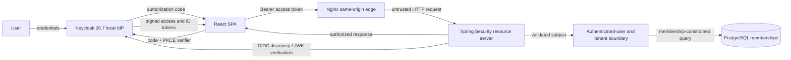

# Identity and Tenant-Isolation Threat Model

## Scope

This model covers the Day 2 local OIDC flow, bearer-token API boundary, synthetic
identity data, application memberships, and tenant-scoped demonstration endpoint.
It does not claim production-ready identity or cover future knowledge, AI, MCP, or
workflow capabilities.

## Assets

- OIDC sessions, authorization codes, PKCE verifier state, access tokens, and JWKs.
- Stable identity subjects, profile attributes, platform roles, and memberships.
- Organization and workspace metadata and every future tenant-owned record.
- Administrative endpoints and the authorization decisions protecting them.
- Synthetic local credentials and reproducible security-test evidence.

## Actors

- Authenticated members, tenant administrators, auditors, and platform admins.
- Unauthenticated or malicious browser clients.
- A compromised account, browser extension, dependency, or frontend script.
- A developer operating the synthetic local environment.
- The local identity provider and the API resource server.

## Trust boundaries and data flow

The browser, edge proxy, URL organization slug, token payload before validation,
and UI visibility are untrusted. Trust begins only after the API validates the JWT
and resolves the validated subject to an application membership.

## Abuse cases and mitigations

| Abuse case | Primary mitigations |
| --- | --- |
| Forged, modified, expired, or wrong-issuer JWT | Resource-server signature, issuer, timestamp, and audience validation; fail closed with 401 |
| Role escalation through arbitrary claims | Read only allowlisted realm roles from the validated token; method/route authorization; application membership remains separate |
| Acme user requests Globex URL | Central tenant authorization resolves membership from subject and slug; denial tests in both directions |
| Frontend hides admin controls but API is called directly | API enforces `PLATFORM_ADMIN`; UI checks are presentation only |
| Confused deputy uses caller-supplied organization ID | Controllers pass a slug to an authorization service; repositories receive only an authorized tenant context |
| Unknown identity has a valid provider token | Return a generic authorization denial; do not auto-provision or reveal membership data |
| Access token stolen through XSS | Restrictive CSP, no token logging/rendering, `sessionStorage` instead of `localStorage`, short token lifetime; production BFF remains under consideration |
| Authorization code interception or replay | Authorization Code Flow with PKCE, exact localhost redirect URIs, provider state/nonce checks |
| Open redirect after login/logout | Exact localhost redirect and post-logout URI allowlists in the realm import |
| Identity provider unavailable or signing keys cannot refresh | Login reports unavailable; API fails token validation closed; public health remains intentionally available |
| Deleted membership with still-valid token role | Tenant access always consults current database membership; provider role alone cannot grant tenant access |
| Synthetic credentials reused outside local development | Clearly labeled credentials, localhost-only client configuration, no production secrets, documented reset procedure |

## Residual risks

- JavaScript-accessible bearer tokens remain exposed to successful same-origin XSS.
- Local HTTP, fixed synthetic passwords, and development-mode Keycloak are unsafe
  outside a developer workstation.
- Provider logout does not instantly revoke every issued access token.
- Realm-role mapping can drift from production provider claim shapes.
- Local seed data keys users by subject; multi-issuer production support requires
  issuer-qualified subjects.
- Browser OIDC E2E may remain outside hosted CI; API authorization and token smoke
  tests reduce but do not eliminate that gap.

