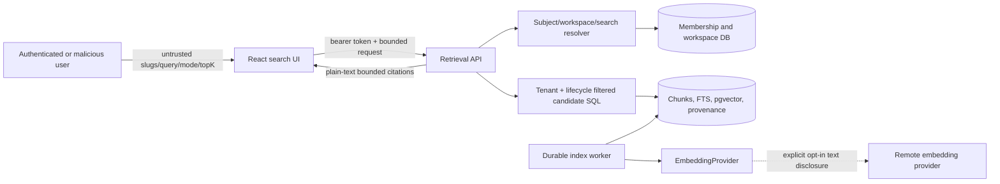

# Retrieval Threat Model

## Scope and assets

This model covers reconciliation, chunking, optional embeddings, PostgreSQL
lexical/vector candidate selection, RRF fusion, citations, snippets, capabilities,
evaluation, and the Knowledge search UI. Assets include normalized enterprise
text, queries, chunks, locators, tenant/version ownership, vectors, provider
credentials, index state, ranks, and timing behavior.

It excludes answer generation, chat, prompts, agents, tools, MCP, and workflows.

## Data-flow diagram

## Threat analysis

| Threat | Trust boundary | Mitigation | Residual risk |
| --- | --- | --- | --- |
| Cross-tenant retrieval leakage | API to candidate SQL | Resolve current membership first; tenant/workspace predicates and ownership joins are inside lexical/vector SQL | Future query changes require negative integration tests |
| Rank before authorization | Candidate SQL | No global candidate query; authorization, ACTIVE, READY, and last-known-good predicates precede ranking | Query-plan timing may still reveal coarse workload characteristics |
| IDOR or slug substitution | URL to resolver | Signed subject plus org/workspace ownership and operation checks; no chunk lookup API | Privileged platform admin remains high impact |
| Archived content leakage | Document lifecycle to search | `documents.status = ACTIVE` in every candidate query; no deletion-worker dependency | Already returned snippets cannot be revoked from client memory |
| Historical/obsolete version leakage | Version/index selection | Exclude any index shadowed by a newer READY index for the same document | Explicit historical retrieval is not implemented |
| External provider disclosure | Provider boundary | No remote provider by default; explicit opt-in; governance documentation; bounded batches/timeouts | Approved providers still receive text/query content |
| API-key leakage | Configuration/log boundary | Environment-only secrets; never serialize/log; capabilities omit endpoints/keys | Operators with environment access can inspect secrets |
| Malicious/oversized query | Browser to API/DB/provider | Strip, 2,000-character cap, topK/candidate/batch bounds, parameterized SQL | Pathological FTS input may still consume bounded CPU |
| Embedding cost amplification | Search/index to provider | Provider disabled by default, timeouts, batch/topK limits, durable bounded attempts | Production needs quotas/rate limits per tenant |
| Malformed or poisoned vectors | Provider to DB | Count/order, exact dimension, finite-value, model/provider validation | A valid but low-quality vector can degrade relevance |
| Dimension mismatch | Provider/index/query | Persist and filter provider/model/dimension; fail closed before distance | Model vendors may change behavior without changing identifiers |
| NaN/infinite values | Provider to persistence/query | Reject all non-finite components; pgvector also rejects them | Extreme finite values may still distort similarity |
| Query/content log leakage | Application logging | Log query ID/length and counts only; never full query, snippet, chunk, vector, or text | Infrastructure access logs require deployment review |
| Snippet XSS | API JSON to React | Plain text, bounded length, React escaping, no raw HTML/Markdown rendering | Future highlighting must preserve encoding |
| Duplicate indexing/race | Reconciler/worker to DB | Unique version/generation and one-job constraints; `ON CONFLICT`; row claims with `SKIP LOCKED` | Manual DB writes can bypass application sequencing |
| Stale worker claims | Worker lifecycle | Timed stale recovery and bounded attempt counter | Long provider latency must remain below claim timeout |
| Model-space mixing | Query vector to chunks | Exact provider/model/dimension equality in vector candidate SQL | Reindex orchestration remains future work |
| Similarity inference | Search response | Authorized candidates only, topK cap, no vector/raw hidden tenant statistics | Authorized users can probe content in their own scope |
| Cross-tenant cache leakage | API/runtime | No shared retrieval-result cache in Day 4 | A future cache must key identity/tenant/version/mode |
| Candidate-pool denial of service | DB ranking | Tenant-scoped SQL, LIMIT 50 per path, topK 20, query bound | Large single-tenant corpora need measured indexes/quotas |
| Backfill omission | Deployment to reconciler | Scheduled idempotent scan for every READY version lacking generation 1 | Disabled scheduler delays availability, not authorization |
| PDF citation fabrication | Chunker to response | Never cross text-unit boundaries; copy persisted locator; tests assert pages | Bad source extraction would propagate existing provenance errors |
| Silent vector fallback | Capability/mode boundary | Explicit VECTOR/HYBRID fails when unavailable; AUTO reports actual used mode | Users may overestimate deterministic smoke quality without labels |

## External provider privacy boundary

No remote embedding provider is enabled by default. If one is introduced and
explicitly configured, normalized document text during indexing and user search
queries during vector retrieval may leave the platform. Production enablement
requires organizational approval, data-governance and retention review, provider
contract assessment, regional controls, and secret rotation. The platform must
not claim enterprise data always remains local when such a provider is enabled.

## Required verification

Integration and composed verification must cover 401/403, Auditor denial,
organization/workspace confusion, pre-ranking tenant filters with a stronger
foreign-tenant match, archive exclusion, last-known-good cutover, failed-index
fallback, deterministic page-bounded chunks, vector validation, unavailable
mode errors, bounded inputs, stale recovery, duplicate prevention, citations,
and evaluation thresholds.
